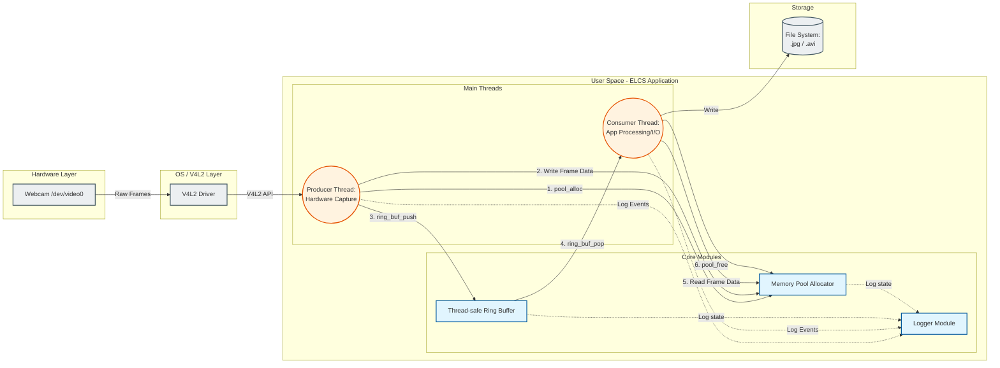

```mermaid
flowchart LR
    subgraph Hardware Layer
        cam[Webcam /dev/video0]
    end

    subgraph OS / V4L2 Layer
        v4l2_drv[V4L2 Driver]
    end

    subgraph User Space - ELCS Application
        subgraph Core Modules
            logger[Logger Module]
            pool[Memory Pool Allocator]
            ring_buf[Thread-safe Ring Buffer]
        end

        subgraph Main Threads
            producer((Producer Thread:\nHardware Capture))
            consumer((Consumer Thread:\nApp Processing/I/O))
        end

        %% Data and control flow
        cam -->|Raw Frames| v4l2_drv
        v4l2_drv -->|V4L2 API| producer
        
        producer -->|1. pool_alloc| pool
        producer -->|2. Write Frame Data| pool
        producer -->|3. ring_buf_push| ring_buf
        
        ring_buf -->|4. ring_buf_pop| consumer
        consumer -->|5. Read Frame Data| pool
        consumer -->|6. pool_free| pool
        
        %% Logging
        producer -.->|Log Events| logger
        consumer -.->|Log Events| logger
        ring_buf -.->|Log state| logger
        pool -.->|Log state| logger
    end

    subgraph Storage
        fs[(File System:\n.jpg / .avi)]
    end

    %% Storage flow
    consumer -->|Write| fs

    classDef core fill:#e1f5fe,stroke:#01579b,stroke-width:2px;
    classDef thread fill:#fff3e0,stroke:#e65100,stroke-width:2px;
    classDef hardware fill:#eceff1,stroke:#455a64,stroke-width:2px;
    
    class logger,pool,ring_buf core;
    class producer,consumer thread;
    class cam,v4l2_drv,fs hardware;
```