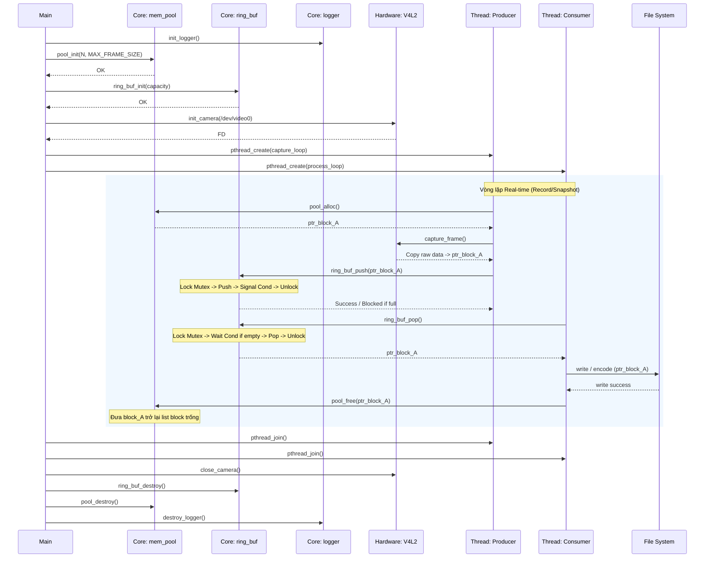

```mermaid
sequenceDiagram
    participant Main
    participant MemPool as Core: mem_pool
    participant RingBuf as Core: ring_buf
    participant Logger as Core: logger
    participant V4L2 as Hardware: V4L2
    participant Producer as Thread: Producer
    participant Consumer as Thread: Consumer
    participant Disk as File System

    %% Khởi tạo
    Main->>Logger: init_logger()
    Main->>MemPool: pool_init(N, MAX_FRAME_SIZE)
    MemPool-->>Main: OK
    Main->>RingBuf: ring_buf_init(capacity)
    RingBuf-->>Main: OK
    Main->>V4L2: init_camera(/dev/video0)
    V4L2-->>Main: FD

    %% Start Threads
    Main->>Producer: pthread_create(capture_loop)
    Main->>Consumer: pthread_create(process_loop)

    %% Capture Flow
    rect rgb(240, 248, 255)
        Note over Producer,Consumer: Vòng lặp Real-time (Record/Snapshot)
        
        %% Bước 1: Xin block bộ nhớ trống
        Producer->>MemPool: pool_alloc()
        MemPool-->>Producer: ptr_block_A
        
        %% Bước 2: Đọc dữ liệu từ cam thẳng vào buffer
        Producer->>V4L2: capture_frame()
        V4L2-->>Producer: Copy raw data -> ptr_block_A
        
        %% Bước 3: Đẩy con trỏ vào Ring Buffer
        Producer->>RingBuf: ring_buf_push(ptr_block_A)
        Note over RingBuf: Lock Mutex -> Push -> Signal Cond -> Unlock
        RingBuf-->>Producer: Success / Blocked if full
        
        %% Bước 4: Consumer lấy buffer ra xử lý
        Consumer->>RingBuf: ring_buf_pop()
        Note over RingBuf: Lock Mutex -> Wait Cond if empty -> Pop -> Unlock
        RingBuf-->>Consumer: ptr_block_A
        
        %% Bước 5: Ghi file (I/O)
        Consumer->>Disk: write / encode (ptr_block_A)
        Disk-->>Consumer: write success
        
        %% Bước 6: Trả block bộ nhớ về Pool
        Consumer->>MemPool: pool_free(ptr_block_A)
        Note over MemPool: Đưa block_A trở lại list block trống
    end

    %% Teardown
    Main->>Producer: pthread_join()
    Main->>Consumer: pthread_join()
    Main->>V4L2: close_camera()
    Main->>RingBuf: ring_buf_destroy()
    Main->>MemPool: pool_destroy()
    Main->>Logger: destroy_logger()
```